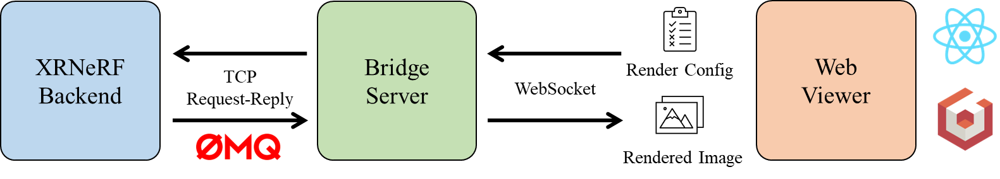

# XRNeRF Viewer 

## 1 Overview

The following figure illustrates how the XRNeRF viewer works: 



- ***Web Viewer***. This is where the users can view the XRNeRF render output in an interactive manner. Taking the user desired render config(e.g., camera extrinsic, render resolution) as input, the web viewer send the render config to the bridge server via WebSocket connection. Once the bridge server offers a rendered image, the web viewer receives and displays the image with overlayed scene components(e.g., grid, axis viewer). The web viewer is developed using [Babylon.js](https://www.babylonjs.com/) and packaged into a [React](https://react.dev/) application utilizing [Create React App](https://create-react-app.dev/).

- ***Bridge Server***. The bridge server is designed and implemented to connect the XRNeRF backend and the viewer frontend. Specifically, the bridge server receives the render config from the web viewer and save it to the state. Then, the XRNeRF backend constantly infers images using the state. The render outputs are forwared to the web viewer by the bridge server.

- ***XRNeRF Backend***. The XRNeRF backend is responsible for generating render result using the user-specified settings. It communicates with the bridge server by [ZeroMQ](https://zeromq.org/).

## 2 Quick Start

### 2.1 Start Server

Please follow the instructions in [XRNeRF serving](../../services/xrnerf/README.md) to start the server.


### 2.2 Start Client

#### 2.2.1 Install Dependencies


The `package.json` contains '' dependicies to build the viewer, which can be installed using Node Package Manager(`npm`). It's suggested to manage `Node.js` installations with Node Version Manager(`nvm`). The installation instructions of `nvm` can be found [here](https://heynode.com/tutorial/install-nodejs-locally-nvm/).

The viewer is built using `Node.js 18.15`. Once you have `Node.js` correctly configured, install node packages:

```shell
# make sure that your current working directory is 'xrprimer/web_renderer/xrnerf'
cd xrprimer/web_renderer/xrnerf

# install node packages using configuration in package.json
npm install
```

#### 2.2.2 Start Viewer

Build and run the viewer using:

```shell
# start the viewer

# Windows
.\start.bat

# TODO: Linux
# .\start.sh
```

To open the viewer window, open the browser and visit http://localhost:3000/. If the server has been properly deployed, the viewer will automatically connect to the server and display the render output.
