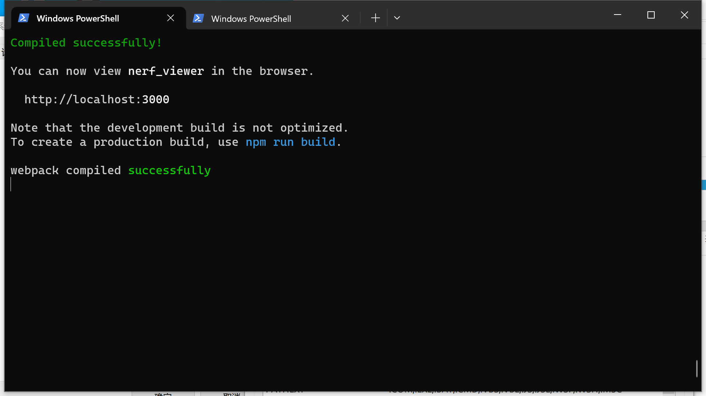
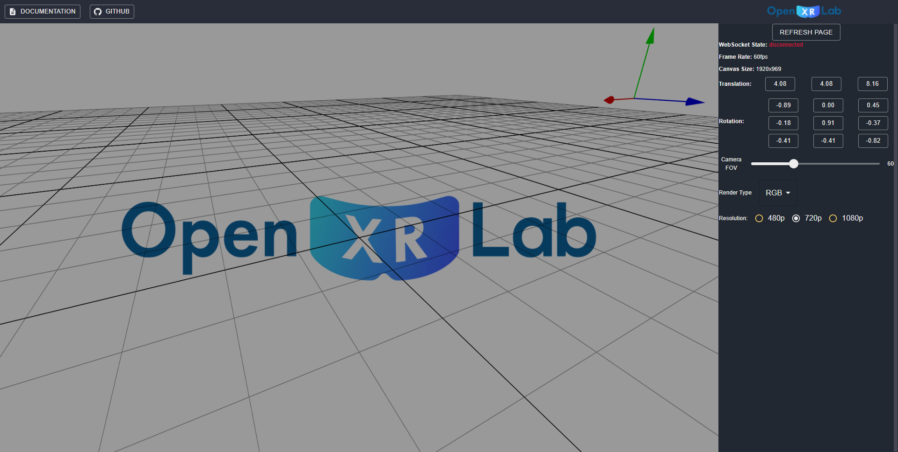
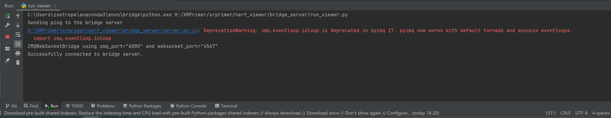
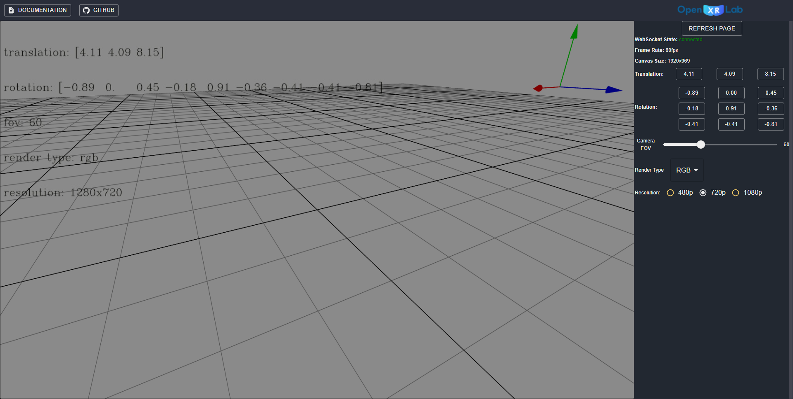

# Nerf Viewer Quick Start

## 1 Client

### 1.1 Install Dependencies

#### 1.1.1 Install NVM

Please follow the instructions in:

https://juejin.cn/post/7120267871950733320/

#### 1.1.2 Install Node

Once you have nvm correctly configured, install node 18.15.0 using the commands below:

```shell
# install node 18.15.0
nvm install 18.15.0

# activate node 18.15.0
nvm use 18.15.0
```

#### 1.1.3 Install Node Packages


```shell
# make sure that your current working directory is 'client'
cd ./client

# install node packages using configuration in client/package.json
npm install
```

### 1.2 Start Viewer

Build and run the viewer using:

```shell
# make sure that your current working directory is 'client'
cd ./client

# start the viewer
npm start
```

Then, check whether viewer is successfully compiled:



Visit http://localhost:3000/ in the browser:



## 2 Bridge Server

### 2.1 Install Dependencies

```shell

cd ./bridge_server

# create a virtual environment
conda create -n BridgeServer python=3.7

conda activate BridgeServer

# install dependencies
pip install -r ./requirements.txt
```

#### 2.2 Start Server

```
python ./run_viewer.py
```

Check whether server is successfully deployed:



Open the browser and visit http://localhost:3000/. Then, check whether the server is connected with the viewer:

